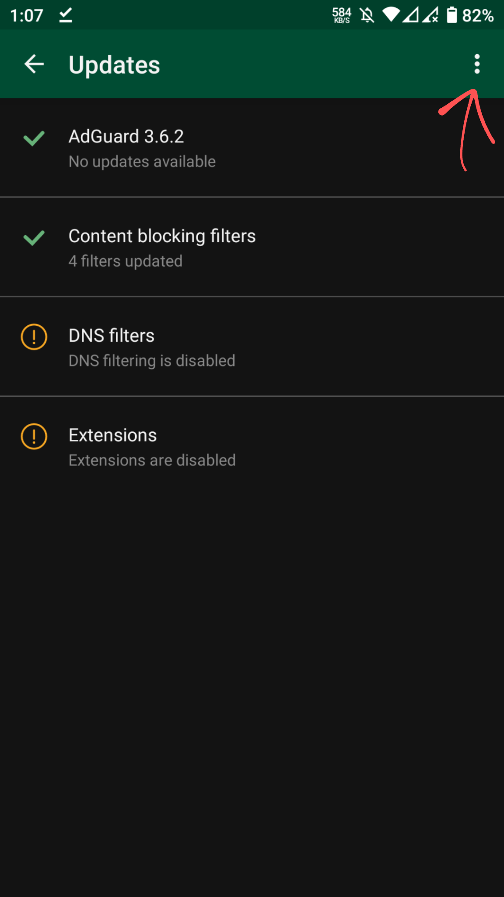
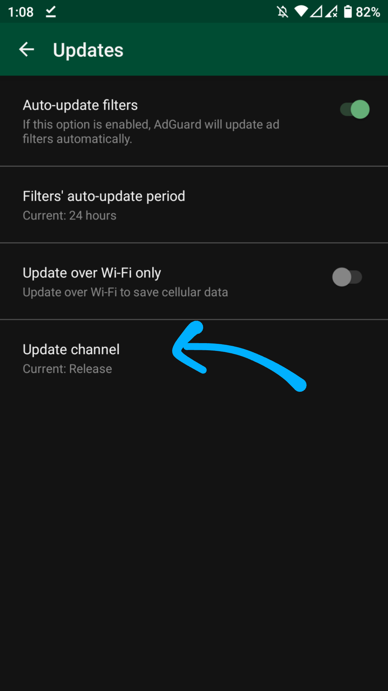
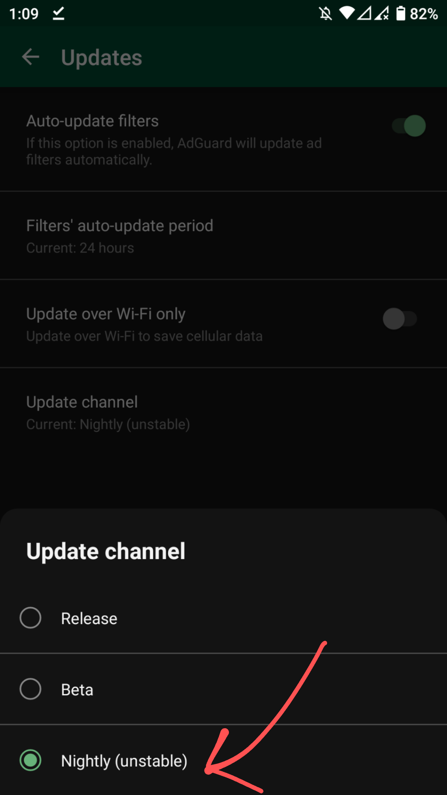
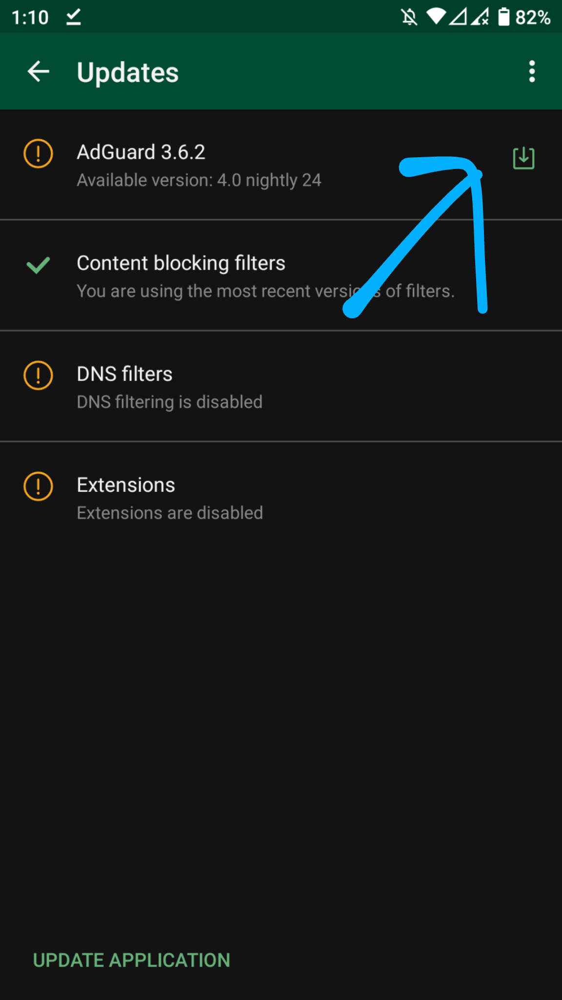
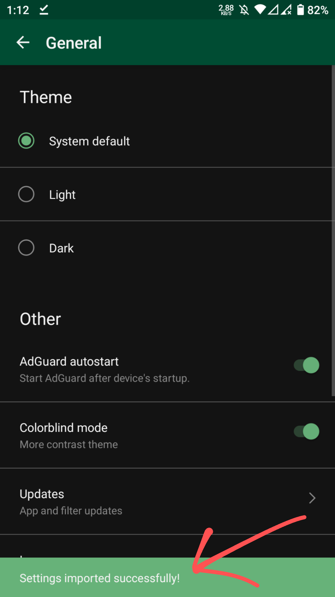

# This json is created by Nahid Hassan Bulbul

## how to setup?
# Follow the instructions

# If you like this setting make sure to give a ✨ star

# <a href="https://drive.google.com/folderview?id=1Chw370iACwxiBNAJeh_mq-alT1IGMFNI"> Download Adguard Apk </a>
